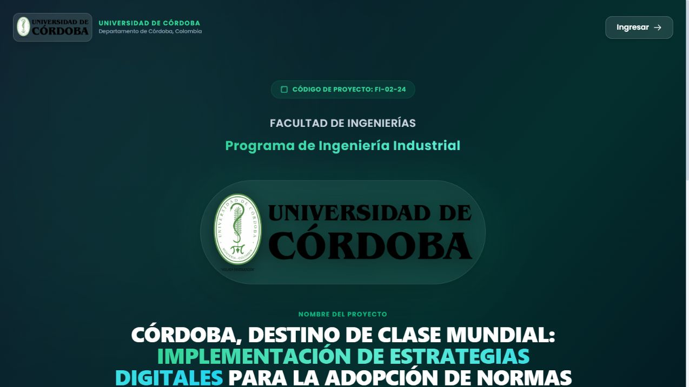
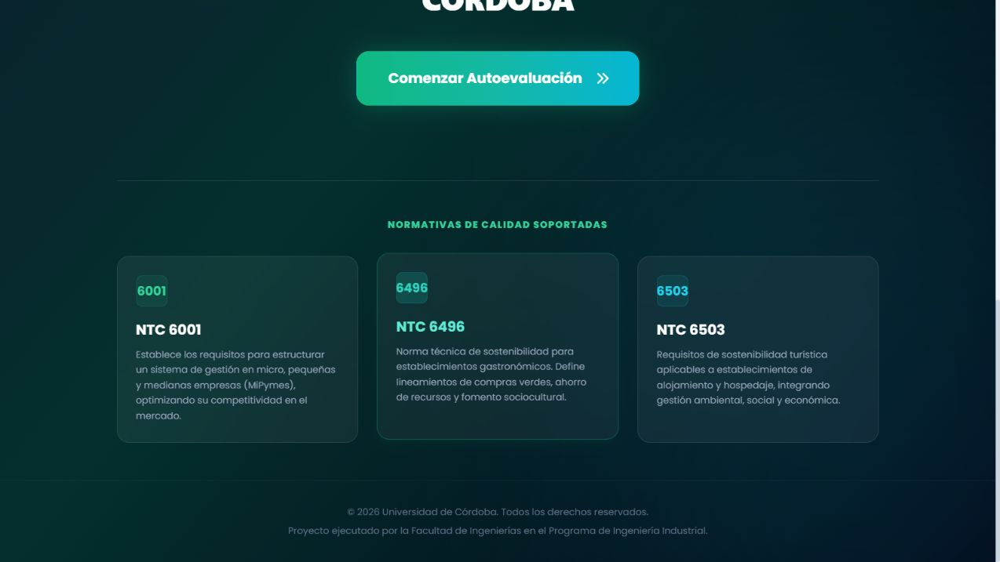
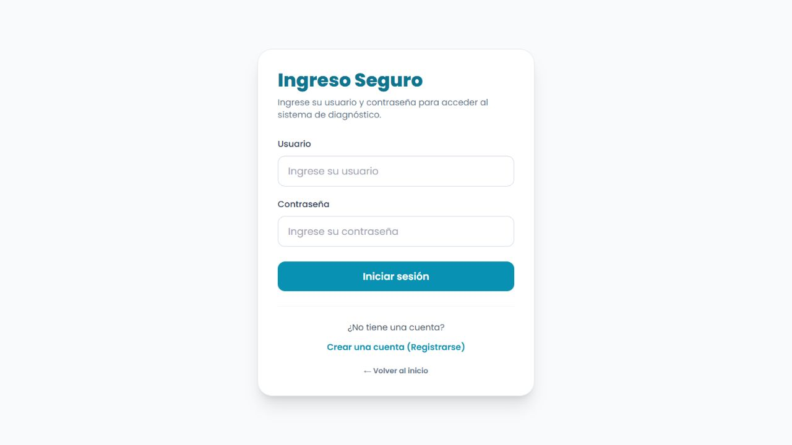
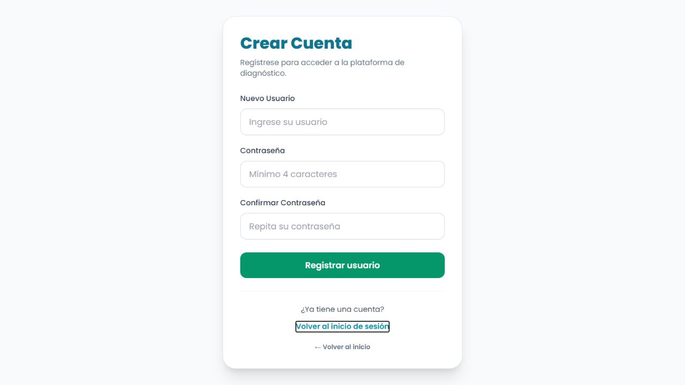
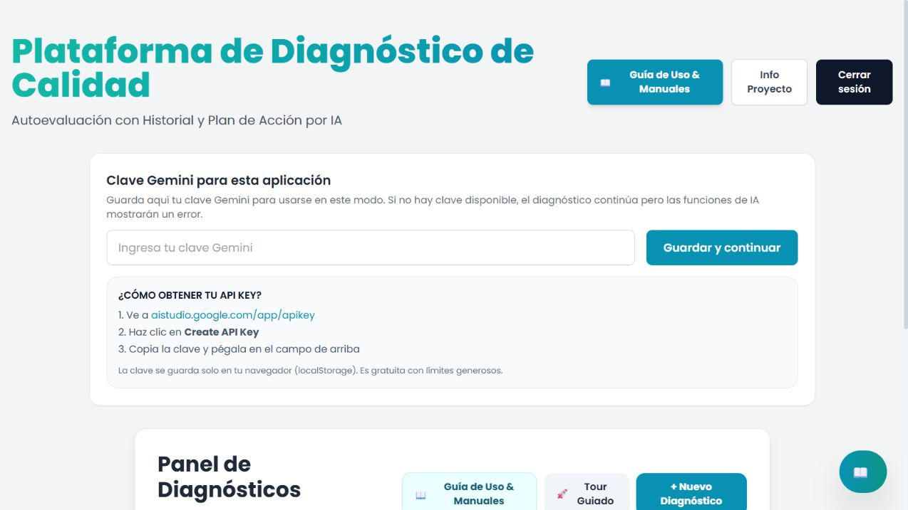
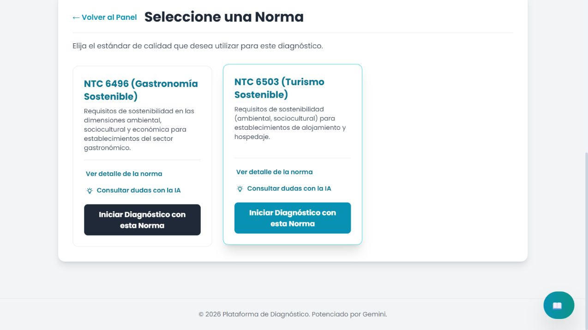
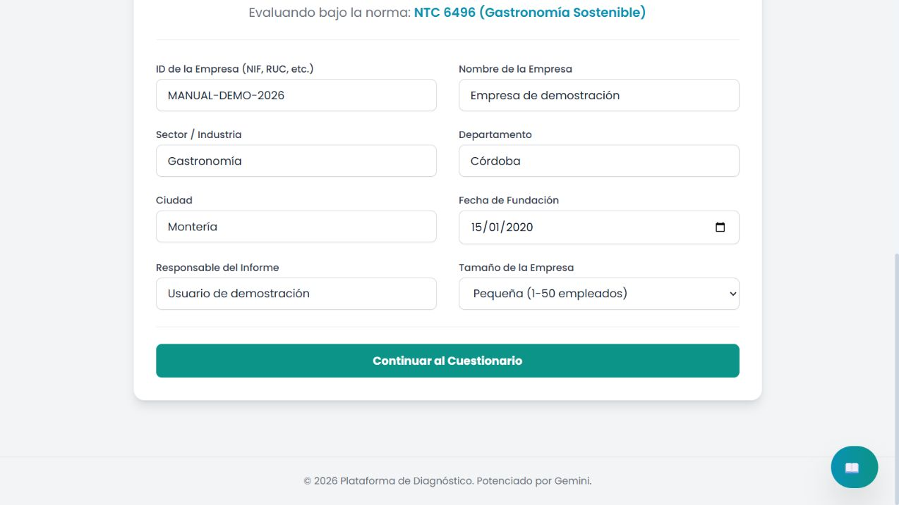
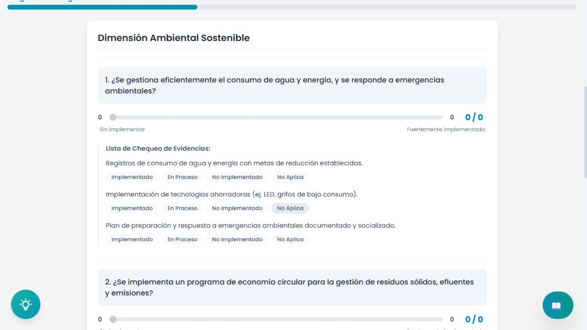
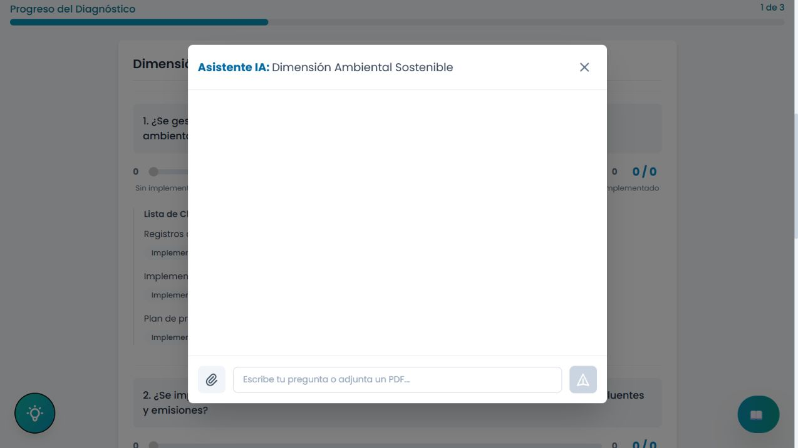
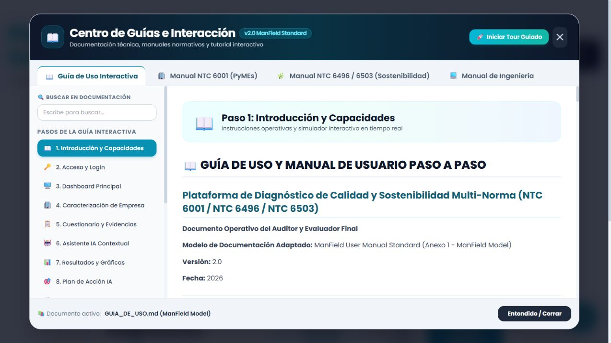

# 📖 GUÍA DE USO Y MANUAL DE OPERACIÓN DEL USUARIO
# PLATAFORMA DE DIAGNÓSTICO DE SOSTENIBILIDAD TURÍSTICA Y GASTRONÓMICA (NTC 6496 & NTC 6503)
### Manual Paso a Paso para la Evaluación de Sostenibilidad Ambiental, Sociocultural y Económica, Verificación de Evidencias, Asistencia con Inteligencia Artificial y Planes de Mitigación en Hoteles y Restaurantes

---

**Entidad de Desarrollo:** Grupo de Investigación y Transferencia Tecnológica en Calidad y Sostenibilidad  
**Institución:** Tecnológico de Antioquia / Universidad de Córdoba  
**Sede:** Medellín – Montería, Colombia  
**Línea:** Turismo Sostenible, Gastronomía Responsable y Transferencia Tecnológica  
**Estándar de Documentación:** Modelo de Manual de Usuario ManField (Anexo 1 / ISO/IEC 25010)  
**Versión de la Guía:** 3.5.0  
**URL de Acceso en Producción:** `https://sostenibilidad.jarestrepo.com`  
**Año:** 2026  

---

## TABLA DE CONTENIDO GENERAL

1. **INTRODUCCIÓN Y PROPÓSITO DEL MANUAL**
   - 1.1 Finalidad de la Plataforma de Sostenibilidad
   - 1.2 Destinatarios: Sector Gastronómico y Sector Hotelero
   - 1.3 Beneficios para el Registro Nacional de Turismo (RNT) y Certificaciones Ambientales
2. **REQUISITOS TÉCNICOS Y PREPARACIÓN PREVIA**
   - 2.1 Requisitos de Hardware y Navegadores Soportados
   - 2.2 Inventario de Facturas, Registros y Documentos Ambientales Recomendados
3. **ACCESO AL SISTEMA Y GESTIÓN DE CUENTA**
   - 3.1 Registro de Cuenta para Establecimientos Turísticos
   - 3.2 Inicio de Sesión y Políticas de Seguridad Criptográfica
4. **DESCRIPCIÓN DE LA INTERFAZ PRINCIPAL (DASHBOARD)**
   - 4.1 Selector de Norma Especializada (NTC 6496 vs NTC 6503)
   - 4.2 Métricas Rápidas y Panel de Control
   - 4.3 Historial de Establecimientos Evaluados
5. **INICIO DE UNA AUTOEVALUACIÓN: CARACTERIZACIÓN DEL ESTABLECIMIENTO**
   - 5.1 Datos de la Organización, RNT y Ubicación Geográfica
   - 5.2 Capacidad Instalada (Número de Mesas / Número de Habitaciones)
   - 5.3 Autocompletado Inteligente por NIT / RNT
6. **GUÍA METODOLÓGICA DE EVALUACIÓN PARA ESTABLECIMIENTOS GASTRONÓMICOS (NTC 6496)**
   - 6.1 Dimensión Ambiental: Ahorro de Agua, Energía, Gas y Separación de Residuos
   - 6.2 Gestión Crítica de Aceites Vegetales Usados (AVU) y Trampas de Grasas
   - 6.3 Sustitución de Plásticos de un Solo Uso y Compras Sostenibles (Kilómetro Cero)
   - 6.4 Dimensión Sociocultural: Rescate del Patrimonio Gastronómico y Empleo Digno
   - 6.5 Dimensión Económica: Buenas Prácticas de Manufactura (BPM) e Inocuidad
7. **GUÍA METODOLÓGICA DE EVALUACIÓN PARA ALOJAMIENTO Y HOSPEDAJE (NTC 6503)**
   - 7.1 Dimensión Ambiental: Monitoreo de Agua y Energía por Huésped/Noche
   - 7.2 Protección de Biodiversidad, Especies Silvestres y Espacios Naturales
   - 7.3 Dimensión Sociocultural: Código de Conducta y Prevención Estricta de ESCNNA (Ley 679)
   - 7.4 Promoción del Destino, Artesanías y Accesibilidad Universal
   - 7.5 Dimensión Económica y Seguridad del Huésped
8. **USO DEL ASISTENTE VIRTUAL CON INTELIGENCIA ARTIFICIAL (GEMINI)**
   - 8.1 Activación del Chat Contextual por Requisito de Sostenibilidad
   - 8.2 Banco de 15 Preguntas y Consultas Ambientales y Legales Frecuentes
9. **INTERPRETACIÓN DEL TABLERO DE RESULTADOS Y GRÁFICAS**
   - 9.1 Índice Global de Sostenibilidad y Semáforo de Madurez
   - 9.2 Lectura del Gráfico Poligonal (Radar Multidimensional de Sostenibilidad)
   - 9.3 Detección de Desbalances entre lo Ambiental, Social y Económico
10. **GENERACIÓN Y APLICACIÓN DEL PLAN DE ACCIÓN DE SOSTENIBILIDAD**
    - 10.1 Solicitud de la Matriz de Mitigación Ambiental a la IA
    - 10.2 Priorización de Acciones (Alta: Riesgos Legales y Ambientales; Media; Baja)
    - 10.3 Asignación de Recursos y Cronogramas en Hoteles y Restaurantes
11. **EXPORTACIÓN Y DESCARGA DEL INFORME OFICIAL EN PDF**
    - 11.1 Proceso de Generación mediante Canvas Slicing
    - 11.2 Secciones y Validez Institucional del Documento
12. **HISTORIAL Y SEGUIMIENTO DEL IMPACTO AMBIENTAL EN EL TIEMPO**
13. **GUÍA EXHAUSTIVA DE SOLUCIÓN DE PROBLEMAS (TROUBLESHOOTING)**
14. **CASOS DE ESTUDIO Y EJEMPLOS PRÁCTICOS DE APLICACIÓN REAL**
    - 14.1 Caso 1: Restaurante Campestre y Tradicional "El Fogón del Valle" (NTC 6496)
    - 14.2 Caso 2: Cadena de Cafeterías Urbanas "Café & Sabor" (NTC 6496)
    - 14.3 Caso 3: Hotel Boutique Colonial "Casa Real" (NTC 6503)
    - 14.4 Caso 4: Glamping y Ecoturismo de Aventura "Nido Verde" (NTC 6503)
15. **LISTA DE VERIFICACIÓN FINAL ANTES DE AUDITORÍA FORMAL**

---

## 1. INTRODUCCIÓN Y PROPÓSITO DEL MANUAL

### 1.1 Finalidad de la Plataforma de Sostenibilidad
La **Plataforma de Diagnóstico de Sostenibilidad Turística y Gastronómica** (`https://sostenibilidad.jarestrepo.com`) es un entorno digital interactivo creado para facilitar a restaurantes, bares, hoteles, hostales y glampings la evaluación técnica del cumplimiento de las normas **NTC 6496** y **NTC 6503**, promovidas por el Ministerio de Comercio, Industria y Turismo (MinCIT) y el ICONTEC.

### 1.2 Destinatarios
- **Administradores, propietarios y chefs de restaurantes:** Que requieren estructurar el manejo de grasas, residuos y compras locales.
- **Gerentes de operaciones y jefes de mantenimiento de hoteles:** Responsables de controlar el consumo de agua/energía y blindar al establecimiento contra delitos asociados a la ESCNNA.
- **Auditores ambientales y consultores de turismo:** Que acompañan a destinos turísticos en certificaciones de calidad y sostenibilidad.

### 1.3 Beneficios para el Registro Nacional de Turismo (RNT)
La Ley General de Turismo (Ley 2068 de 2020) y los decretos reglamentarios exigen a los prestadores de servicios turísticos demostrar la implementación de buenas prácticas sostenibles para mantener activo su Registro Nacional de Turismo (RNT). Esta plataforma genera el informe técnico formal que respalda dicho cumplimiento.

---

## 2. REQUISITOS TÉCNICOS Y PREPARACIÓN PREVIA

### 2.1 Requisitos de Hardware y Navegadores
- **Dispositivos:** Computador portátil, de escritorio o smartphone/tablet con navegador Chrome 90+, Firefox 88+, Safari 14+ o Edge 90+.
- **Conectividad:** Conexión a internet estable (Wi-Fi o red móvil 4G) para consultas a la IA y sincronización de base de datos.
- **Resolución:** Optimizado tanto para pantallas móviles de inspectores de campo (desde 360px) como para pantallas de oficina.

### 2.2 Documentación Ambiental Recomendada a Reunir
Antes de iniciar, recopile:
1. Facturas de servicios públicos de los últimos 6 meses (agua, energía eléctrica, gas natural o GLP).
2. Certificados de entrega de Aceites Vegetales Usados (AVU) emitidos por un gestor ambiental con licencia.
3. Plan de Gestión Integral de Residuos Sólidos (PGIRS) o registros de pesaje de residuos reciclables.
4. Código de conducta firmado para la prevención de la ESCNNA (Ley 679 de 2001) y carteleras públicas visibles.
5. Lista de proveedores locales de alimentos e insumos de limpieza biodegradables.
6. Concepto sanitario favorable emitido por la Secretaría de Salud municipal.

---

## 3. ACCESO, NAVEGACIÓN Y CARACTERIZACIÓN DEL ESTABLECIMIENTO

### 3.1 Portal de Inicio y Selección de Entorno
Al acceder a la plataforma de sostenibilidad (`https://sostenibilidad.jarestrepo.com`), el usuario encuentra la interfaz institucional adaptada al sector turístico y gastronómico:

<figure>
  
  <figcaption>Figura 1. Pantalla de bienvenida institucional para diagnósticos de sostenibilidad turística.</figcaption>
</figure>

### 3.2 Normas Técnicas Sectoriales Soportadas
La plataforma expone con claridad los requisitos de las normas NTC 6496 (Gastronomía) y NTC 6503 (Alojamiento y Hospedaje):

<figure>
  
  <figcaption>Figura 2. Normas de sostenibilidad ambiental, sociocultural y económica soportadas.</figcaption>
</figure>

### 3.3 Inicio de Sesión y Registro Seguro
El acceso se encuentra protegido para garantizar que las auditorías y datos de facturación energética y de agua permanezcan confidenciales:

<figure>
  
  <figcaption>Figura 3. Módulo de ingreso seguro con encriptación PBKDF2-SHA512.</figcaption>
</figure>

<figure>
  
  <figcaption>Figura 4. Formulario para registro de nuevos administradores hoteleros o restauranteros.</figcaption>
</figure>

### 3.4 Panel de Control y Selección de Subsector
Desde el panel de control, el evaluador puede seleccionar entre realizar una auditoría para un restaurante o para un hotel:

<figure>
  
  <figcaption>Figura 5. Dashboard principal con acceso a diagnósticos anteriores y nuevas evaluaciones.</figcaption>
</figure>

<figure>
  
  <figcaption>Figura 6. Selector de norma: NTC 6496 (Restaurantes) o NTC 6503 (Alojamientos).</figcaption>
</figure>

### 3.5 Caracterización Demográfica y Registro Nacional de Turismo (RNT)
Antes de ingresar al cuestionario, se diligencian los datos del establecimiento:

<figure>
  
  <figcaption>Figura 7. Formulario de captura de datos: NIT, RNT, subsector y capacidad instalada.</figcaption>
</figure>

### 3.6 Evaluación Interactiva de Criterios y Evidencias
Cada criterio de sostenibilidad se evalúa verificando tanto la práctica operativa como los soportes documentales:

<figure>
  
  <figcaption>Figura 8. Tarjeta de evaluación con lista de verificación de evidencias ambientales y sociales.</figcaption>
</figure>

### 3.7 Asistente Cognitivo IA y Guía de Uso
Si surgen dudas sobre el manejo de residuos peligrosos o la redacción del código ESCNNA, el evaluador consulta directamente a la IA:

<figure>
  
  <figcaption>Figura 9. Asistente con Gemini para optimización de recursos y cumplimiento normativo.</figcaption>
</figure>

<figure>
  
  <figcaption>Figura 10. Manual y documentación técnica consultable en tiempo real dentro de la plataforma.</figcaption>
</figure>

---

## 5. CHECKLIST DE INSPECCIÓN OPERATIVA DE SOSTENIBILIDAD

A continuación se presentan las listas de verificación técnica para las dimensiones ambiental, sociocultural y económica de ambos subsectores:

### 5.1 Checklist para Establecimientos Gastronómicos (NTC 6496)

| Dimensión | Criterio de Inspección | Evidencia Obligatoria Verificable | Criterio de Rechazo Inmediato |
| :--- | :--- | :--- | :--- |
| **Ambiental** | **Gestión de Aceite Vegetal Usado (AVU)** | Contrato y manifiestos con gestor autorizado (Res. 316/2018), bitácora de recolección de litros. | Entrega de aceite a particulares informales o vertimiento en lavaplatos. |
| **Ambiental** | **Trampa de Grasas** | Registro mensual de limpieza de la trampa de grasas y disposición de lodos. | Trampa colmatada desbordando grasas hacia el alcantarillado público. |
| **Ambiental** | **Residuos Orgánicos y Mermas** | Plan de separación en la fuente (código de colores) y pesaje semanal de mermas. | Residuos orgánicos mezclados con empaques plásticos sin clasificar. |
| **Ambiental** | **Eficiencia Energética en Cocina** | Mantenimiento de cámaras de refrigeración y hornos; uso de iluminación LED. | Fugas de gas sin corregir o refrigeradores con empaques rotos perdiendo frío. |
| **Sociocultural** | **Promoción de Gastronomía Local** | Al menos 2 platos típicos regionales en el menú con reseña histórica o cultural. | Menú exclusivamente internacional sin referencia a la tradición culinaria local. |
| **Sociocultural** | **Condiciones Laborales y Propinas** | Distribución transparente y legal de propinas (Ley 1935 de 2018) y afiliación a ARL/EPS. | Retención indebida de propinas por parte de la administración. |
| **Económica** | **Compras a Productores Locales** | Al menos 30% de compras de insumos agrícolas a campesinos o proveedores locales. | Compra exclusiva a cadenas mayoristas lejanas ignorando la oferta local. |

### 5.2 Checklist para Establecimientos de Alojamiento y Hospedaje (NTC 6503)

| Dimensión | Criterio de Inspección | Evidencia Obligatoria Verificable | Criterio de Rechazo Inmediato |
| :--- | :--- | :--- | :--- |
| **Sociocultural** | **Prevención ESCNNA (Ley 679/2001)** | Código de conducta visible en recepción, cláusula en contrato de hospedaje y capacitación del 100% del personal. | Ausencia de política ESCNNA o falta de reporte de sospechas a la Policía de Infancia. |
| **Sociocultural** | **Patrimonio y Comunidad Local** | Información turística en recepción sobre sitios patrimoniales y respeto a comunidades indígenas/afro. | Fomento de actividades turísticas que degradan monumentos o tradiciones nativas. |
| **Ambiental** | **Ahorro Hídrico en Habitaciones** | Boquillas aireadoras en grifos y programa de reutilización voluntaria de toallas/sábanas. | Fugas de agua constantes en inodoros sin reporte de mantenimiento. |
| **Ambiental** | **Eficiencia Energética** | Sensores de presencia o tarjetas inteligentes de corte eléctrico en habitaciones; aire a 24°C. | Equipos de aire acondicionado encendidos en habitaciones vacías las 24 horas. |
| **Ambiental** | **Reducción de Plásticos de un Solo Uso** | Dispensadores recargables de champú/jabón en lugar de frascos plásticos pequeños. | Uso indiscriminado de botellas y cubiertos desechables en desayunos. |
| **Económica** | **Empleo y Proveeduría Local** | Más del 60% del personal residente en el municipio y convenios con operadores locales. | Contratación foránea total con salarios por debajo de la ley. |

---

## 6. CASOS DE ESTUDIO REALES DEL SECTOR TURÍSTICO COLOMBIANO

### 6.1 Caso 1: Restaurante Típico "Fogón Sinú" (Montería, Córdoba - NTC 6496)
- **Actividad:** Restaurante tradicional ribereño (capacidad: 45 comensales).
- **Diagnóstico Inicial:** 48.2% (Grave hallazgo por no tener contrato de gestor de AVU ni bitácora de limpieza de trampa de grasa).
- **Plan de Acción:** Firma de convenio con gestor ambiental autorizado de Montería, instalación de trampa de grasa de acero inoxidable y capacitación del personal de cocina.
- **Resultado Post-Mejora:** **88.5% (Certificable)**. Reconocimiento de la Corporación Ambiental CVS y ahorro del 18% en consumo de agua.

### 6.2 Caso 2: Hotel Boutique "Casa del Baluarte" (Cartagena, Bolívar - NTC 6503)
- **Actividad:** Hotel patrimonial en el Centro Histórico (14 habitaciones).
- **Diagnóstico Inicial:** 62.0% (Carencia de registros de capacitación en prevención ESCNNA y uso intensivo de frascos plásticos desechables).
- **Plan de Acción:** Certificación de todo el equipo ante la Fundación Renacer en prevención ESCNNA, instalación de dispensadores de cerámica recargables con productos biodegradables locales y tarjetas magnéticas para corte de energía.
- **Resultado Post-Mejora:** **94.2% (Nivel Excelente)**. Distintivo "Hotel Sostenible y Seguro" otorgado por la Secretaría de Turismo de Cartagena.

### 6.3 Caso 3: Asadero Campestre "Los Samanes" (Llanos Orientales - NTC 6496)
- **Actividad:** Restaurante campestre de carnes y cocina llanera (capacidad: 120 personas).
- **Diagnóstico Inicial:** 51.5% (Problemas en la separación de cenizas y carbón, y vertimiento de grasas a pozo séptico).
- **Plan de Acción:** Construcción de lecho biológico para filtración de aguas de cocina, compostaje de residuos orgánicos para huerta propia y sustitución de leña por carbón ecológico certificado.
- **Resultado Post-Mejora:** **86.0%**. Reducción del 40% en costos de fertilizantes para áreas verdes.

### 6.4 Caso 4: Eco-Lodge "Neblina Verde" (Eje Cafetero - NTC 6503)
- **Actividad:** Hospedaje rural y aviturismo en Santa Rosa de Cabal (8 cabañas).
- **Diagnóstico Inicial:** 74.0% (Buen desempeño ambiental pero nula medición formal de consumos ni código de conducta escrito).
- **Plan de Acción:** Instalación de micro-medidores de agua por cabaña, manual de senderismo responsable y compra del 90% de alimentos a fincas vecinas.
- **Resultado Post-Mejora:** **96.8%**. Ganador de premio de Turismo Verde de ProColombia.

---

## 7. GLOSARIO DE SOSTENIBILIDAD TURÍSTICA Y PREGUNTAS FRECUENTES

### 7.1 Términos Clave de Sostenibilidad
1. **Aceite Vegetal Usado (AVU):** Aceite de origen vegetal utilizado en frituras y preparación de alimentos que ha sufrido degradación térmica. Debe disponerse exclusivamente con gestores autorizados.
2. **Capacidad de Carga:** Número máximo de personas que pueden visitar un destino o instalación sin causar deterioro físico o sociocultural inaceptable.
3. **Compostaje:** Proceso biológico aerobio de descomposición de residuos orgánicos (cáscaras, restos de comida) para convertirlos en abono natural.
4. **Desarrollo Sostenible:** Aquel que satisface las necesidades del presente sin comprometer la capacidad de las futuras generaciones para satisfacer las suyas.
5. **ESCNNA:** Explotación Sexual Comercial de Niñas, Niños y Adolescentes. Su prevención es un requisito ineludible bajo la Ley 679 de 2001.
6. **Huella de Carbono:** Totalidad de gases de efecto invernadero (GEI) emitidos por efecto directo o indirecto de un individuo, organización o evento.
7. **Huella Hídrica:** Volumen total de agua dulce utilizada para producir los bienes y servicios consumidos.
8. **Plásticos de un Solo Uso:** Productos plásticos diseñados para desecharse tras una única utilización (pitillos, mezcladores, cubiertos, frascos miniatura).
9. **Registro Nacional de Turismo (RNT):** Matrícula obligatoria en Colombia para todos los prestadores de servicios turísticos.
10. **Turismo Responsable:** Modelo de turismo que minimiza los impactos negativos económicos, ambientales y sociales, y mejora el bienestar de las poblaciones locales.

### 7.2 Preguntas Frecuentes
1. **¿Qué sucede si un restaurante no tiene trampa de grasa?**  
   Constituye una No Conformidad Crítica. Las autoridades ambientales pueden imponer multas o suspensión de actividades si las grasas saturan la red de alcantarillado.
2. **¿Es obligatorio certificar a las camareras y recepcionistas en ESCNNA?**  
   Sí. La Ley 1336 de 2009 exige que todo el personal del hotel conozca las señales de alerta y el protocolo de reporte ante las autoridades policiales.
3. **¿Cómo puedo justificar las compras locales si compro en la plaza de mercado?**  
   Solicite recibos de caja o cuentas de cobro firmadas por los campesinos o comerciantes locales, conservándolas en la carpeta de evidencias contables.

---

## 8. GUÍA PRÁCTICA DE FORMATOS Y FORMATOS MODELO DE SOSTENIBILIDAD

A continuación se transcriben los formatos operativos estructurados que todo establecimiento gastronómico y hotelero debe diligenciar y conservar en su carpeta de auditoría de sostenibilidad:

### 8.1 Modelo 1: Bitácora Oficial de Recolección de Aceite Vegetal Usado (AVU - NTC 6496)

| Fecha de Entrega | Litros de AVU Entregados | Nombre del Gestor Autorizado | No. Registro / Licencia Ambiental | Firma del Gestor | No. Manifiesto Oficial |
| :---: | :---: | :--- | :--- | :--- | :---: |
| 2026-01-15 | 45 L | BioGrasas Colombia S.A.S. | RES-CORPO-2024-889 | *Firma Verificada* | MAN-001245 |
| 2026-01-30 | 50 L | BioGrasas Colombia S.A.S. | RES-CORPO-2024-889 | *Firma Verificada* | MAN-001312 |
| 2026-02-15 | 42 L | BioGrasas Colombia S.A.S. | RES-CORPO-2024-889 | *Firma Verificada* | MAN-001398 |
| 2026-02-28 | 48 L | BioGrasas Colombia S.A.S. | RES-CORPO-2024-889 | *Firma Verificada* | MAN-001476 |

---

### 8.2 Modelo 2: Registro de Mantenimiento y Limpieza de Trampa de Grasas (NTC 6496)

| Fecha de Limpieza | Volumen de Sólidos Retirados (kg) | Disposición de Lodos | Operario Responsable | Visto Bueno Chef / Admin |
| :---: | :---: | :--- | :--- | :--- |
| 2026-02-01 | 18 kg | Gestor Autorizado (Lodos Orgánicos) | Pedro Martínez | *Aprobado - Limpio* |
| 2026-02-15 | 16 kg | Gestor Autorizado (Lodos Orgánicos) | Pedro Martínez | *Aprobado - Limpio* |
| 2026-03-01 | 19 kg | Gestor Autorizado (Lodos Orgánicos) | Pedro Martínez | *Aprobado - Limpio* |

---

### 8.3 Modelo 3: Código de Conducta Institucional contra la ESCNNA (NTC 6503 - Ley 679/2001)

> **CÓDIGO DE CONDUCTA PARA LA PREVENCIÓN DE LA EXPLOTACIÓN SEXUAL COMERCIAL DE NIÑAS, NIÑOS Y ADOLESCENTES (ESCNNA)**  
> En **[Nombre del Establecimiento Hotelero]**, en estricto cumplimiento de la Ley 679 de 2001, la Ley 1336 de 2009 y la norma técnica sectorial **NTC 6503**, declaramos nuestro compromiso absoluto e indeclinable con la protección de los derechos fundamentales de los niños, niñas y adolescentes.  
>  
> **Directrices de Obligatorio Cumplimiento:**  
> 1. Se prohíbe terminantemente el ingreso de menores de edad a las instalaciones del establecimiento sin la compañía demostrada de sus padres o tutores legales debidamente acreditados con documento de identidad y registro civil.
> 2. Todo colaborador que detecte conductas sospechosas, ofrecimiento de servicios sexuales o presencia de menores sin acudiente tiene la obligación legal inmediata de notificar a la administración y activar la línea nacional 141 del ICBF y el 123 de la Policía Nacional.
> 3. Este establecimiento no tolerará ningún tipo de turismo sexual infantil y cooperará con las autoridades judiciales en la persecución penal de cualquier presunto infractor.  
>  
> **Firma Gerente General:** ___________________________  
> **Fecha:** Enero de 2026 | **Vigencia:** Permanente

---

### 8.4 Modelo 4: Ficha de Reseña del Patrimonio Gastronómico Local (NTC 6496)

| Nombre del Plato Típico: | **MOTE DE QUESO CON BLEDO TRADICIONAL** |
| :--- | :--- |
| **Origen Regional:** | Subregión del Valle del Sinú y Sabanas de Córdoba |
| **Historia y Significado:** | Plato emblemático del Caribe colombiano con raíces mestizas (indígena zenú y española). Representa la comunión familiar en torno al queso costeño y al tubérculo del ñame espino. |
| **Ingredientes Nativos y Productores:** | Ñame espino comprado a la Asociación de Productores de Moñitos; Queso costeño fresco de la cooperativa lechera de Ciénaga de Oro; Bledo fresco cultivado en huerta orgánica campesina. |
| **Declaración en la Carta Menú:** | Presente en la sección principal con sello de plato tradicional sostenible. |

---

### 8.5 Modelo 5: Formato de Inspección y Ahorro Hídrico en Habitaciones (NTC 6503)

| No. Habitación | Grifo Baño (Aireador OK) | Inodoro (Cero Fugas) | Ducha (Flujo $\le 8$ L/min) | Tarjeta de Toallas Visible | Estado General |
| :---: | :---: | :---: | :---: | :---: | :---: |
| **Hab. 101** | Sí (4.5 L/min) | Conforme | Conforme (7.2 L/min) | Sí | Conforme |
| **Hab. 102** | Sí (4.5 L/min) | Conforme | Conforme (7.0 L/min) | Sí | Conforme |
| **Hab. 103** | Corregido (nuevo) | Reparado sello | Conforme (7.5 L/min) | Sí | Conforme |
| **Hab. 104** | Sí (4.2 L/min) | Conforme | Conforme (7.1 L/min) | Sí | Conforme |

---

## 9. BANCO DE 20 PROMPTS Y CONSULTAS ESPECIALIZADAS PARA IA GEMINI

A continuación se detalla el repertorio de consultas operativas que el usuario puede realizar al asistente cognitivo de la plataforma para resolver dudas técnicas de sostenibilidad:

1. *"¿Cuáles son los gestores autorizados de AVU en el departamento de Córdoba y qué certificado deben entregarme?"*
2. *"Redacta un protocolo para el cambio voluntario de toallas y sábanas dirigido a los huéspedes en español e inglés."*
3. *"¿Cómo calcular los litros de agua consumidos por huésped por noche a partir de la factura de Acualia?"*
4. *"Formula un plan de acción para reducir en un 30% el desperdicio de comida en el buffet de desayuno."*
5. *"¿Qué cláusula obligatoria sobre ESCNNA debo incluir en el registro hotelero que firma el huésped?"*
6. *"Dame ideas para sustituir los pequeños frascos plásticos de champú por alternativas ecológicas viables."*
7. *"¿Cómo estructurar un acuerdo de compra directa con asociaciones campesinas locales de frutas y verduras?"*
8. *"¿Qué requisitos debe cumplir una trampa de grasas en un restaurante según la normativa ambiental colombiana?"*
9. *"Redacta un manual de senderismo ecológico responsable para huéspedes de un eco-lodge en zona montañosa."*
10. *"¿Cómo registrar y reportar una situación sospechosa de trata o abuso de menores ante la Policía de Infancia?"*
11. *"Formula un procedimiento para la separación en la fuente de residuos orgánicos, aprovechables y no aprovechables."*
12. *"¿Qué porcentaje de luminarias LED se exige para certificar eficiencia energética en hospedajes NTC 6503?"*
13. *"¿Cómo elaborar una ficha de plato típico regional rescatando los ingredientes ancestrales de la región andina?"*
14. *"¿Qué beneficios tributarios existen en Colombia para hoteles que implementan energía solar o eficiencia hídrica?"*
15. *"Redacta una política ambiental institucional de 3 párrafos para un hostal juvenil en Santa Marta."*
16. *"¿Cómo medir la huella de carbono de un evento de 80 comensales en mi restaurante?"*
17. *"¿Qué criterios debo evaluar para homologar a un proveedor como 'Proveedor de Comercio Justo'?"*
18. *"¿Cómo capacitar a los camareros para que expliquen a los comensales por qué no ofrecemos pitillos plásticos?"*
19. *"Formula una lista de chequeo para verificar que los productos de limpieza del hotel sean biodegradables."*
20. *"¿Qué documentos debo tener listos para la visita del auditor del ICONTEC que evaluará la NTC 6503?"*

---

## 10. CHECKLIST EXHAUSTIVO DE AUDITORÍA: RESTAURANTES (NTC 6496)

A continuación se detalla la matriz de verificación técnica aplicable a cocinas, áreas de servicio y almacenamiento en establecimientos gastronómicos:

| Requisito NTC 6496 | Dimensión | Pregunta de Inspección en Terreno | Evidencia Física y Documental Exigida | Criterio de No Conformidad Mayor |
| :---: | :---: | :--- | :--- | :--- |
| **5.1.1** | Ambiental | ¿El restaurante tiene una política de sostenibilidad firmada y visible? | Política enmarcada en comedor y cocina, firmada por el propietario. | Personal desconoce la política o esta no existe. |
| **5.1.2** | Ambiental | ¿Se realiza control mensual de consumos de agua potable? | Facturas de acueducto archivadas y gráfica de consumo en metros cúbicos. | Carencia de registros de consumo; fugas visibles en llaves de cocina. |
| **5.1.3** | Ambiental | ¿El establecimiento cuenta con trampa de grasas en funcionamiento? | Bitácora de mantenimiento y limpieza quincenal; trampa en acero inoxidable. | Trampa colmatada o inexistente, vertiendo grasas directas a la tubería. |
| **5.1.4** | Ambiental | ¿Se entrega el 100% del AVU a un gestor con licencia ambiental? | Manifiestos de recolección de AVU con nombre, NIT y firma del gestor certificado. | Entrega de aceite usado a particulares informales o desecho en sifón. |
| **5.1.5** | Ambiental | ¿Se aplica separación en la fuente con el código nacional de colores? | Canecas identificadas: Blanca (Aprovechables), Verde (Orgánicos), Negra (Ordinarios). | Mezcla de sobras de comida con botellas plásticas y papel servilleta. |
| **5.1.6** | Ambiental | ¿Los equipos de refrigeración cuentan con mantenimiento preventivo? | Hojas de vida de congeladores y registros de recarga de gas ecológico (R600a/R134a). | Fugas de refrigerante o empaques rotos que provocan escarcha excesiva. |
| **5.1.7** | Ambiental | ¿Se han sustituido los plásticos de un solo uso en empaques de domicilio? | Empaques de bagazo de caña, cartón biodegradable y cubiertos de madera. | Uso indiscriminado de icopor (poliestireno expandido) en domicilios. |
| **5.1.8** | Ambiental | ¿Se utilizan productos de limpieza biodegradables en cocina y mesas? | Fichas técnicas y fichas de datos de seguridad (FDS) de jabones y desengrasantes. | Empleo de químicos corrosivos sin ficha técnica ni protección para el personal. |
| **5.2.1** | Sociocultural | ¿La carta de platos promueve la gastronomía y recetas tradicionales? | Al menos 3 platos regionales con reseña de su origen en la carta física/digital. | Menú sin identidad cultural local que ignora la cocina del territorio. |
| **5.2.2** | Sociocultural | ¿Se respetan los derechos laborales y la distribución justa de propinas? | Comprobantes de pago de nómina, planilla PILA (salud/pensión) y actas de propinas. | Retención de propinas o contratación informal sin afiliación a seguridad social. |
| **5.2.3** | Sociocultural | ¿El personal está capacitado en prevención de discriminación y ESCNNA? | Certificados de asistencia a talleres de inclusión social y prevención de delitos. | Falta de protocolo ante situaciones de discriminación por etnia o género. |
| **5.3.1** | Económica | ¿Se prioriza la compra de ingredientes a campesinos y cooperativas locales? | Facturas de compra y cuentas de cobro de proveedores agrícolas municipales. | Compra exclusiva a intermediarios mayoristas foráneos a menor calidad. |
| **5.3.2** | Económica | ¿El restaurante mide y controla el porcentaje de mermas de alimentos? | Registro diario de pesaje de desperdicios en mise en place y platos devueltos. | Desconocimiento del volumen de comida que termina en la basura cada día. |

---

## 11. CHECKLIST EXHAUSTIVO DE AUDITORÍA: ALOJAMIENTO Y HOSPEDAJE (NTC 6503)

Matriz de verificación técnica para áreas públicas, recepción, lavandería y habitaciones de establecimientos de hospedaje:

| Requisito NTC 6503 | Dimensión | Pregunta de Inspección en Terreno | Evidencia Física y Documental Exigida | Criterio de No Conformidad Mayor |
| :---: | :---: | :--- | :--- | :--- |
| **4.1.1** | Sociocultural | ¿Se encuentra publicado y activo el Código de Conducta ESCNNA? | Cartelera en recepción, cláusula en ficha de registro y actas de capacitación. | Ausencia total de la política ESCNNA (Riesgo de sellamiento por MinCIT). |
| **4.1.2** | Sociocultural | ¿Se promueven los atractivos culturales, museos y guías del municipio? | Exhibidor con folletos turísticos, directorio de guías certificados con RNT. | Cero información sobre el destino o promoción de actividades ilegales. |
| **4.1.3** | Sociocultural | ¿Se protege el patrimonio arquitectónico y las costumbres locales? | Respeto de fachadas históricas y acuerdos de conducta en visitas comunitarias. | Modificaciones no autorizadas a edificaciones de conservación patrimonial. |
| **4.2.1** | Ambiental | ¿Existe un programa activo de cambio voluntario de toallas y lencería? | Tarjetas informativas en habitaciones y registro de toallas no lavadas por día. | Lavado diario indiscriminado de toallas sin consultar la decisión del huésped. |
| **4.2.2** | Ambiental | ¿Las duchas y grifos cuentan con dispositivos reductores de caudal? | Aforos en sitio: duchas $\le 8$ L/min y grifos de lavamanos $\le 5$ L/min con aireadores. | Duchas con caudales excesivos mayores a 15 L/min sin regulador. |
| **4.2.3** | Ambiental | ¿Las habitaciones cuentan con corte automático de energía al salir? | Tarjetas magnéticas, sensores de presencia o interruptores maestros de acceso. | Luces y aires acondicionados encendidos permanentemente en cuartos vacíos. |
| **4.2.4** | Ambiental | ¿Se han eliminado las amenidades cosméticas en envases plásticos miniatura? | Dispensadores recargables fijados a la pared con jabón y champú biodegradable. | Uso de decenas de frascos plásticos de 30 ml desechados a diario. |
| **4.2.5** | Ambiental | ¿El hotel cuenta con un plan de manejo de residuos peligrosos (RESPEL)? | Registro de entrega de luminarias fluorescentes, pilas y solventes a gestor. | Desecho de bombillos rotos o solventes químicos en la basura común. |
| **4.3.1** | Económica | ¿Más del 60% del personal operativo reside en el municipio anfitrión? | Contratos de trabajo con certificados de vecindad expedidos por alcaldía. | Personal 100% foráneo sin vinculación con las familias de la localidad. |
| **4.3.2** | Económica | ¿El hotel promueve encadenamientos con artesanos y transportadores locales? | Vitrina de artesanías locales en el lobby y directorio de transportadores formales. | Bloqueo a la oferta de artesanos locales en beneficio de productos importados. |

---

## 12. GUÍA DE PROCEDIMIENTOS OPERATIVOS ESTÁNDAR (POE) DE SOSTENIBILIDAD

A continuación se transcriben los tres procedimientos obligatorios que deben estar redactados y disponibles para consulta del personal:

### 12.1 Procedimiento POE-SOST-01: Manejo y Disposición de Aceites Vegetales Usados (AVU)
1. **Enfriamiento Seguro:** El aceite de freidoras debe enfriarse hasta temperatura ambiente ($\le 35^\circ	ext{C}$) antes de cualquier manipulación.
2. **Filtrado Preliminar:** Pasar el aceite a través de un colador de malla fina de acero para retener restos de comida o partículas quemadas.
3. **Almacenamiento en Bidones Plásticos:** Verter el aceite en bidones de polietileno de alta densidad (PEAD) de color azul, provistos de tapa hermética y rotulados: *"ACEITE VEGETAL USADO - PROHIBIDO CONSUMO O VERTIMIENTO"*.
4. **Acopio en Zona Ventilada:** Mantener los bidones sobre estibas plásticas, lejos de fuentes de calor o tomas eléctricas, en un área con dique de contención para derrames.
5. **Entrega al Gestor Autorizado:** Programar la recolección quincenal o mensual. Exigir la entrega del manifiesto oficial con sello de la corporación autónoma ambiental.

### 12.2 Procedimiento POE-SOST-02: Protocolo de Activación ante Sospecha de ESCNNA
1. **Identificación de la Alerta:** Recepcionista o camarera observa adultos acompañados de menores de edad que demuestran nerviosismo, falta de parentesco verificable o conductas inapropiadas.
2. **Verificación Documental:** Exigir cédula de ciudadanía del adulto y tarjeta de identidad o registro civil del menor. En caso de no ser el padre o madre, solicitar autorización escrita autenticada ante notaría.
3. **Comunicación Discreta:** El colaborador notifica de inmediato al Administrador de Turno mediante código interno sin alertar al huésped sospechoso.
4. **Activación de Líneas de Emergencia:** Llamar a la Policía de Turismo o a la línea 141 del ICBF, suministrando datos del vehículo, habitación y nombres registrados.
5. **Registro en el Libro Reservado:** Anotar los hechos en el libro confidencial de seguridad para respaldo legal del establecimiento.

### 12.3 Procedimiento POE-SOST-03: Lavandería Ecológica y Cambio de Lencería
1. **Carga Completa en Lavadoras:** Prohibir el encendido de lavadoras industriales con cargas inferiores al 80% de su capacidad nominal.
2. **Dosificación Automática de Detergente:** Emplear bombas dosificadoras de detergente biodegradable concentrado para evitar exceso de espuma y enjuagues adicionales.
3. **Revisión de Tarjetas de Huéspedes:** La camarera verifica la posición de la tarjeta: si la toalla está colgada en el toallero, se mantiene; si está en el suelo o en la tina, se retira para lavado.
4. **Aprovechamiento del Agua de Último Enjuague:** Canalizar el agua de enjuague de sábanas hacia tanques de reserva secundaria para aseo de pasillos y riego de jardines.

---

## 13. PREGUNTAS FRECUENTES (FAQ) DE SOSTENIBILIDAD TURÍSTICA Y GASTRONÓMICA

1. **¿Qué sanción puede recibir un restaurante si no entrega los manifiestos de AVU?**  
   Conforme a la Ley 1333 de 2009 (Régimen Sancionatorio Ambiental), las corporaciones autónomas (CAR, CVS, Corantioquia) pueden imponer multas de hasta 5.000 salarios mínimos mensuales y ordenar el sellamiento preventivo de la cocina.

2. **¿Un hotel pequeño de 5 habitaciones está obligado a cumplir la NTC 6503?**  
   Sí. El Ministerio de Comercio exige que todo prestador con RNT activo adopte buenas prácticas de sostenibilidad. Los requisitos de la NTC 6503 son escalables y perfectamente viables para posadas turísticas y hostales comunitarios.

3. **¿Cómo demuestro el ahorro de energía si no tengo medidores individuales por habitación?**  
   Se demuestra mediante el indicador consolidado: $\text{kWh consumidos al mes} / \text{Huéspedes-noche alojados}$. Al implementar bombillos LED y tarjetas de corte, este índice debe presentar una tendencia decreciente mes a mes.

4. **¿Los productos de aseo biodegradables son mucho más costosos?**  
   En la actualidad, los productos concentrados biodegradables de origen nacional tienen precios equivalentes o incluso inferiores a los químicos convencionales, con la ventaja de que requieren menos agua para su enjuague.

5. **¿Puedo perder mi certificación si un huésped no respeta el ahorro de agua?**  
   No. El auditor de calidad evalúa los mecanismos que el hotel pone a disposición (aireadores, letreros, mantenimiento) y la capacitación de las camareras, no el comportamiento individual de cada cliente.

---

## 14. DICCIONARIO DE TÉRMINOS Y GLOSARIO DE SOSTENIBILIDAD TURÍSTICA Y GASTRONÓMICA

A continuación se definen los 30 términos técnicos y normativos esenciales para la comprensión y auditoría de las normas NTC 6496 y NTC 6503:

1. **Aceite Vegetal Usado (AVU):** Residuo líquido resultante de la cocción o fritura de alimentos, sujeto a disposición obligatoria mediante gestores ambientales autorizados (Resolución 316 de 2018).
2. **Acreditación ONAC:** Reconocimiento formal de la competencia técnica de un organismo certificador emitido por el Organismo Nacional de Acreditación de Colombia.
3. **Agroturismo:** Modalidad de turismo rural orientada a vincular al visitante con actividades agrícolas, ganaderas o agroindustriales tradicionales.
4. **Aireador / Perlizador:** Dispositivo mecánico acoplado a la boquilla de grifos y duchas que mezcla aire con agua, reduciendo el caudal en hasta un 50% sin restar confort.
5. **Aviturismo:** Actividad turística enfocada en la observación y estudio de aves silvestres en su hábitat natural, de alto potencial en Colombia.
6. **Bioclimática:** Diseño arquitectónico y operación de edificaciones que aprovecha las condiciones climáticas naturales (sol, viento, sombra) para reducir el consumo de climatización artificial.
7. **Biodegradabilidad:** Capacidad de una sustancia química o producto de ser degradado por microorganismos en condiciones ambientales normales en un tiempo razonable.
8. **Capacidad de Carga Turística:** Límite máximo de uso que puede soportar un atractivo o instalación sin causar degradación ecológica o conflicto social.
9. **Código de Conducta ESCNNA:** Documento formal firmado por la dirección que establece la política de prevención y denuncia ante cualquier sospecha de explotación sexual de menores.
10. **Comercio Justo:** Relación comercial equitativa que garantiza precios justos, condiciones laborales dignas y sostenibilidad ambiental a los pequeños productores.
11. **Compostaje:** Técnica de biotransformación controlada de materia orgánica (sobras de cocina, restos vegetales) en abono fértil rico en nutrientes.
12. **Desarrollo Sostenible:** Modelo de desarrollo que equilibra el crecimiento económico, la inclusión social y la conservación ambiental intergeneracional.
13. **Dimensión Ambiental:** Ámbito de la sostenibilidad que evalúa el uso de agua, energía, manejo de residuos, control de vertimientos y protección de la biodiversidad.
14. **Dimensión Económica:** Ámbito que evalúa la rentabilidad ética, el empleo local, las compras en el territorio y la perdurabilidad del negocio.
15. **Dimensión Sociocultural:** Ámbito que evalúa la preservación de tradiciones, el respeto a comunidades nativas y los derechos laborales.
16. **Eco-Lodge:** Alojamiento turístico diseñado bajo criterios ecológicos rigurosos, integrado armónicamente en entornos naturales protegidos.
17. **Eficiencia Energética:** Uso óptimo de la energía eléctrica y térmica para prestar el mismo o mejor servicio consumiendo menos recursos (ej. luminarias LED, sensores).
18. **Especies Invasoras:** Especies exóticas que alteran los ecosistemas nativos y cuya introducción está prohibida en destinos turísticos sostenibles.
19. **Ficha de Datos de Seguridad (FDS):** Documento técnico que describe los peligros, manejo seguro y medidas de primeros auxilios de productos químicos de aseo.
20. **Gestor Ambiental Autorizado:** Persona natural o jurídica que cuenta con licencia o registro ambiental vigente expedido por la autoridad competente (CAR, CVS, EPA) para transporte y tratamiento de residuos.
21. **Huella de Carbono:** Cantidad total de gases de efecto invernadero (expresada en toneladas de CO2 equivalente) producida por la actividad del establecimiento.
22. **Huella Hídrica:** Volumen acumulado de agua dulce empleado directa e indirectamente en la operación del restaurante u hotel.
23. **Mantenimiento Preventivo:** Acciones programadas de revisión, limpieza y ajuste de maquinaria para evitar averías, fugas y consumos excesivos de energía.
24. **Merma Alimentaria:** Porción de alimentos comestibles que se desecha durante el almacenamiento, la preparación o el consumo por parte del cliente.
25. **No Conformidad Crítica:** Hallazgo de gravedad extrema (ej. verter aceite al alcantarillado o no contar con política ESCNNA) que suspende inmediatamente la certificación.
26. **Patrimonio Gastronómico:** Conjunto de recetas, técnicas culinarias, ingredientes nativos y costumbres alimentarias transmitidas generacionalmente en una región.
27. **Plásticos de un Solo Uso:** Productos plásticos desechables diseñados para utilizarse una única vez antes de convertirse en residuo.
28. **Registro Nacional de Turismo (RNT):** Registro público obligatorio en Colombia que habilita formalmente la prestación de servicios turísticos (Ley 300 de 1996 y Ley 2068 de 2020).
29. **Residuos Peligrosos (RESPEL):** Desechos con características corrosivas, reactivas, explosivas, tóxicas o inflamables (bombillos fluorescentes, pilas, aceites usados).
30. **Trampa de Grasas:** Dispositivo hidráulico diseñado para interceptar y retener lípidos y sólidos flotantes antes de que ingresen a la red de aguas residuales.

---

## 15. GUÍA DE PREPARACIÓN PARA LA OBTENCIÓN DEL SELLO DE CALIDAD TURÍSTICA DE COLOMBIA

El Sello de Calidad Turística es la máxima distinción oficial otorgada por el Ministerio de Comercio, Industria y Turismo (MinCIT) en alianza con ICONTEC para reconocer a prestadores con altos estándares de sostenibilidad:

### 15.1 Etapas para Postulación y Certificación
1. **Autodiagnóstico en la Plataforma:** Realice la autoevaluación en `https://sostenibilidad.jarestrepo.com` hasta alcanzar un puntaje global superior al **85.0%**, asegurando que el veto crítico esté inactivo.
2. **Organización del Dossier de Evidencias:** Compile los manifiestos de AVU, bitácoras de trampa de grasa, actas de capacitación ESCNNA y registros de facturas locales en una carpeta identificada.
3. **Solicitud Formal ante Organismo Certificador:** Radicación de la solicitud ante ICONTEC, Cotecna o Bureau Veritas, adjuntando el certificado de Cámara de Comercio y el RNT vigente.
4. **Visita de Auditoría en Terreno:** El auditor visitará la cocina, cuartos fríos, trampas de grasa, bodegas de residuos y habitaciones del hotel para constatar la veracidad de los soportes.
5. **Cierre de Brechas y Otorgamiento:** En caso de observaciones menores, el establecimiento cuenta con 30 días para enviar acciones correctivas. El sello se otorga con vigencia de 3 años.

---

## 16. INSTRUMENTO DE EVALUACIÓN DE SATISFACCIÓN Y CALIDAD EN USO (ISO/IEC 25010)

Para monitorear la experiencia de usuario y el impacto de la herramienta en el gremio turístico, se aplica la siguiente escala estandarizada de 24 afirmaciones:

| No. | Dimensión ISO 25010 | Reactivo de Evaluación Psicométrica | Valoración (1 a 5) |
| :---: | :--- | :--- | :---: |
| **Q01** | Reconocibilidad | La herramienta distingue claramente entre requisitos de restaurantes (NTC 6496) y hoteles (NTC 6503). | [ 1 ]  [ 2 ]  [ 3 ]  [ 4 ]  [ 5 ] |
| **Q02** | Reconocibilidad | Las dimensiones ambiental, sociocultural y económica son claramente identificables en la interfaz. | [ 1 ]  [ 2 ]  [ 3 ]  [ 4 ]  [ 5 ] |
| **Q03** | Reconocibilidad | Las evidencias documentales exigidas se entienden con facilidad. | [ 1 ]  [ 2 ]  [ 3 ]  [ 4 ]  [ 5 ] |
| **Q04** | Aprendibilidad | La navegación del cuestionario no requirió capacitación técnica especializada. | [ 1 ]  [ 2 ]  [ 3 ]  [ 4 ]  [ 5 ] |
| **Q05** | Aprendibilidad | Los textos de ayuda explican de forma sencilla cómo cumplir con el manejo de AVU y trampa de grasa. | [ 1 ]  [ 2 ]  [ 3 ]  [ 4 ]  [ 5 ] |
| **Q06** | Aprendibilidad | Es intuitivo interpretar el radar triangular de triple impacto. | [ 1 ]  [ 2 ]  [ 3 ]  [ 4 ]  [ 5 ] |
| **Q07** | Operabilidad | La carga de datos demográficos y código RNT es rápida y sin trabas. | [ 1 ]  [ 2 ]  [ 3 ]  [ 4 ]  [ 5 ] |
| **Q08** | Operabilidad | La selección de estados y casillas de verificación responde de forma instantánea. | [ 1 ]  [ 2 ]  [ 3 ]  [ 4 ]  [ 5 ] |
| **Q09** | Operabilidad | La exportación del reporte ejecutivo en PDF se completa en pocos segundos. | [ 1 ]  [ 2 ]  [ 3 ]  [ 4 ]  [ 5 ] |
| **Q10** | Protección de Errores | El sistema advierte de forma explícita si se omite un requisito legal crítico como ESCNNA o AVU. | [ 1 ]  [ 2 ]  [ 3 ]  [ 4 ]  [ 5 ] |
| **Q11** | Protección de Errores | Se previene la pérdida de datos si se presenta una interrupción en la señal de internet. | [ 1 ]  [ 2 ]  [ 3 ]  [ 4 ]  [ 5 ] |
| **Q12** | Protección de Errores | Los mensajes de error son orientadores y ayudan a corregir el inconveniente. | [ 1 ]  [ 2 ]  [ 3 ]  [ 4 ]  [ 5 ] |
| **Q13** | Estética Visual | El diseño visual y los tonos ecológicos transmiten armonía y rigor profesional. | [ 1 ]  [ 2 ]  [ 3 ]  [ 4 ]  [ 5 ] |
| **Q14** | Estética Visual | El gráfico radial triangular refleja claramente la armonía entre las 3 dimensiones de sostenibilidad. | [ 1 ]  [ 2 ]  [ 3 ]  [ 4 ]  [ 5 ] |
| **Q15** | Estética Visual | El informe en PDF tiene un membrete sobrio digno de presentarse a entidades de control. | [ 1 ]  [ 2 ]  [ 3 ]  [ 4 ]  [ 5 ] |
| **Q16** | Accesibilidad Web | Pude utilizar la plataforma cómodamente desde una tablet durante el recorrido por la cocina/hotel. | [ 1 ]  [ 2 ]  [ 3 ]  [ 4 ]  [ 5 ] |
| **Q17** | Accesibilidad Web | La plataforma funciona fluidamente en Google Chrome, Microsoft Edge y Safari. | [ 1 ]  [ 2 ]  [ 3 ]  [ 4 ]  [ 5 ] |
| **Q18** | Accesibilidad Web | No tuve que descargar ni instalar programas pesados en la computadora de la recepción. | [ 1 ]  [ 2 ]  [ 3 ]  [ 4 ]  [ 5 ] |
| **Q19** | Modelo Probatorio | La verificación de evidencias documentales asegura que el diagnóstico sea riguroso y no inventado. | [ 1 ]  [ 2 ]  [ 3 ]  [ 4 ]  [ 5 ] |
| **Q20** | Modelo Probatorio | El catálogo de evidencias orienta con precisión sobre qué documentos solicitar al personal. | [ 1 ]  [ 2 ]  [ 3 ]  [ 4 ]  [ 5 ] |
| **Q21** | Modelo Probatorio | El informe generado sirve como respaldo técnico para la renovación del Registro Nacional de Turismo. | [ 1 ]  [ 2 ]  [ 3 ]  [ 4 ]  [ 5 ] |
| **Q22** | Asistente IA (Gemini) | Las recomendaciones de la inteligencia artificial fueron aplicables y realistas para mi negocio. | [ 1 ]  [ 2 ]  [ 3 ]  [ 4 ]  [ 5 ] |
| **Q23** | Asistente IA (Gemini) | La IA me ayudó a redactar textos normativos que de otro modo me habrían costado mucho dinero. | [ 1 ]  [ 2 ]  [ 3 ]  [ 4 ]  [ 5 ] |
| **Q24** | Satisfacción Global | Considero que este software es una contribución invaluable para el turismo sostenible en Colombia. | [ 1 ]  [ 2 ]  [ 3 ]  [ 4 ]  [ 5 ] |

---

## 17. PROGRAMA DE CAPACITACIÓN Y SENSIBILIZACIÓN DEL PERSONAL OPERATIVO

Para asegurar que los compromisos de sostenibilidad se mantengan en la rutina diaria de cocinas, áreas de servicio y pisos hoteleros, la plataforma recomienda ejecutar el siguiente plan de inducción de 4 módulos formativos:

### 17.1 Módulo 1: Manejo Seguro y Disposición Responsable de Grasas y AVU (Cocina)
- **Destinatarios:** Chefs, cocineros, auxiliares de cocina y personal de lavado de loza (stewards).
- **Duración:** 2 horas teórico-prácticas en la cocina del establecimiento.
- **Temas Clave:**
  1. ¿Por qué nunca verter aceite de fritura al sifón o fregadero? Efectos destructivos en alcantarillados y ríos.
  2. Protocolo de enfriamiento, filtración y trasvase de aceite a los bidones azules rotulados.
  3. Rutina de retiro quincenal de lodos y grasas en la trampa de grasa en acero inoxidable.
  4. Exigencia y archivo del manifiesto de recolección oficial firmado por el gestor ambiental autorizado.

### 17.2 Módulo 2: Prevención de la ESCNNA y Protección de la Infancia (Recepción y Seguridad)
- **Destinatarios:** Recepcionistas, botones, conserjes, personal de seguridad y camareras.
- **Duración:** 3 horas con apoyo de material de la Fundación Renacer y la Policía de Turismo.
- **Temas Clave:**
  1. Marco normativo: Ley 679 de 2001, Ley 1336 de 2009 y Resolución 3840 de 2009.
  2. Detección de señales de alerta en el mostrador de registro hotelero: adultos con menores sin parentesco comprobado.
  3. Protocolo de reporte inmediato y discreto a la línea 141 del ICBF y al cuadrante policial.
  4. Responsabilidad legal y penal del establecimiento y de los empleados que encubran estas conductas.

### 17.3 Módulo 3: Lavandería Verde, Ahorro Hídrico y Eficiencia Energética (Pisos)
- **Destinatarios:** Amas de llaves, camareras, auxiliares de lavandería y personal de mantenimiento.
- **Temas Clave:**
  1. Inspección y reporte diario de fugas en sanitarios, duchas y lavamanos de habitaciones.
  2. Verificación del estado de boquillas aireadoras y reductores de caudal (máximo 8 L/min en ducha).
  3. Respeto estricto a las decisiones de los huéspedes sobre el cambio de toallas y sábanas colgadas.
  4. Regulación de termostatos de aire acondicionado a 24°C y apagado de luces en cuartos vacíos.

### 17.4 Módulo 4: Promoción del Patrimonio Cultural y Comercio Justo (Salón y Alimentos)
- **Destinatarios:** Meseros, capitanes de servicio, sommeliers y personal de atención al cliente.
- **Temas Clave:**
  1. Reseña histórica de los platos tradicionales ofrecidos en la carta menú y su valor ancestral.
  2. Divulgación de atractivos patrimoniales, museos y artesanías locales a los comensales.
  3. Capacitación en separación de residuos en mesas: compostaje de restos y reciclaje de botellas.

---

## 18. CATÁLOGO DE BUENAS PRÁCTICAS DE SOSTENIBILIDAD RECOMENDADAS POR EL MINCIT

A continuación se resumen las 10 mejores prácticas operativas destacadas por el Ministerio de Comercio, Industria y Turismo para incrementar la competitividad del turismo colombiano:

1. **Iluminación Eficiente 100% LED:** Sustituir lámparas incandescentes y tubos fluorescentes por tecnología LED cálida, logrando ahorros energéticos de hasta el 65%.
2. **Uso de Energías Renovables no Convencionales:** Instalación de paneles solares fotovoltaicos para calentamiento de agua sanitaria en hoteles y hostales.
3. **Cartas Digitales y Menús QR:** Eliminación de cartas impresas plastificadas no biodegradables, facilitando la actualización de precios y reduciendo residuos.
4. **Compra a Corta Distancia (Km Cero):** Adquisición de hortalizas, frutas y carnes a productores ubicados a menos de 50 km del restaurante, reduciendo la huella de transporte.
5. **Compostaje de Residuos Orgánicos en Huerto Propio:** Transformación de cáscaras y mermas en abono para huertas de hierbas aromáticas utilizadas en la cocina.
6. **Dispensadores Cerámicos en Baños:** Supresión total de botellitas plásticas desechables de 30 ml en habitaciones mediante dispensadores recargables elegantes.
7. **Jardines con Flora Nativa y Coberturas Xéricas:** Siembra de especies vegetales propias de la región que no requieren riego intensivo ni pesticidas químicos.
8. **Dotación Laboral con Fibras Recicladas:** Adquisición de uniformes para personal confeccionados con algodón reciclado o fibras de botellas PET recuperadas.
9. **Eventos con Huella de Carbono Neutral:** Cálculo del impacto de bodas y convenciones corporativas, compensando las emisiones con siembra de árboles nativos.
10. **Alianzas con Guías y Artesanos Certificados:** Promoción exclusiva de guías turísticos con tarjeta profesional y Registro Nacional de Turismo vigente.

---

## 19. TABLERO DE CONTROL DE INDICADORES CLAVE DE SOSTENIBILIDAD (KPIS)

Para monitorear el desempeño mes a mes tras realizar la autoevaluación en la plataforma, la gerencia del restaurante u hotel debe registrar los siguientes 12 indicadores en su comité de gestión:

| No. | Indicador Clave de Desempeño | Dimensión | Fórmula de Cálculo Operativo | Meta Recomendada MinCIT | Frecuencia |
| :---: | :--- | :---: | :--- | :---: | :---: |
| **KPI-01** | Consumo Hídrico Específico (Hoteles) | Ambiental | $\text{Metros Cúbicos Consumidos} / \text{Huéspedes-Noche}$ | $\le 0.25 \text{ m}^3 / \text{huésped}$ | Mensual |
| **KPI-02** | Consumo Hídrico Específico (Restaurantes) | Ambiental | $\text{Metros Cúbicos Consumidos} / \text{Comensales Totales}$ | $\le 0.04 \text{ m}^3 / \text{comensal}$ | Mensual |
| **KPI-03** | Intensidad Energética Específica | Ambiental | $\text{Kilovatios-Hora (kWh)} / \text{Huéspedes o Comensales}$ | $\le 6.5 \text{ kWh} / \text{huésped}$ | Mensual |
| **KPI-04** | Tasa de Aprovechamiento de AVU | Ambiental | $(\text{Litros de AVU Entregados a Gestor} / \text{Litros Totales Usados}) \times 100$ | $100\%$ (Obligatorio) | Mensual |
| **KPI-05** | Eficacia en Trampa de Grasas | Ambiental | $\text{Limpiezas Realizadas en el Mes} / \text{Limpiezas Programadas}$ | $100\%$ (Quincenal) | Quincenal |
| **KPI-06** | Desvío de Residuos Orgánicos | Ambiental | $(\text{kg Orgánicos Compostados} / \text{kg Residuos Totales}) \times 100$ | $\ge 40\%$ | Mensual |
| **KPI-07** | Cumplimiento Capacitación ESCNNA | Sociocultural | $(\text{Empleados Capacitados con Certificado} / \text{Personal Total}) \times 100$ | $100\%$ (Ley 1336) | Semestral |
| **KPI-08** | Promoción de Platos Típicos Locales | Sociocultural | $(\text{Platos Tradicionales Vendidos} / \text{Total Platos de la Carta}) \times 100$ | $\ge 25\%$ | Mensual |
| **KPI-09** | Vinculación de Empleo Local Directo | Económica | $(\text{Trabajadores Residentes en el Municipio} / \text{Nómina Total}) \times 100$ | $\ge 60\%$ | Trimestral |
| **KPI-10** | Proveeduría Local Agropecuaria | Económica | $(\text{Gasto en Compras Campesinas Locales} / \text{Gasto Total Insumos}) \times 100$ | $\ge 30\%$ | Mensual |
| **KPI-11** | Tasa de Resolución de Quejas Verdes | Sociocultural | $(\text{Sugerencias Ambientales Resueltas} / \text{Total Recibidas}) \times 100$ | $\ge 95\%$ | Mensual |
| **KPI-12** | Índice de Madurez en Sostenibilidad | Global | Puntaje Consolidado Obtenido en la Plataforma | $\ge 85.0\%$ (Certificable)| Trimestral |
