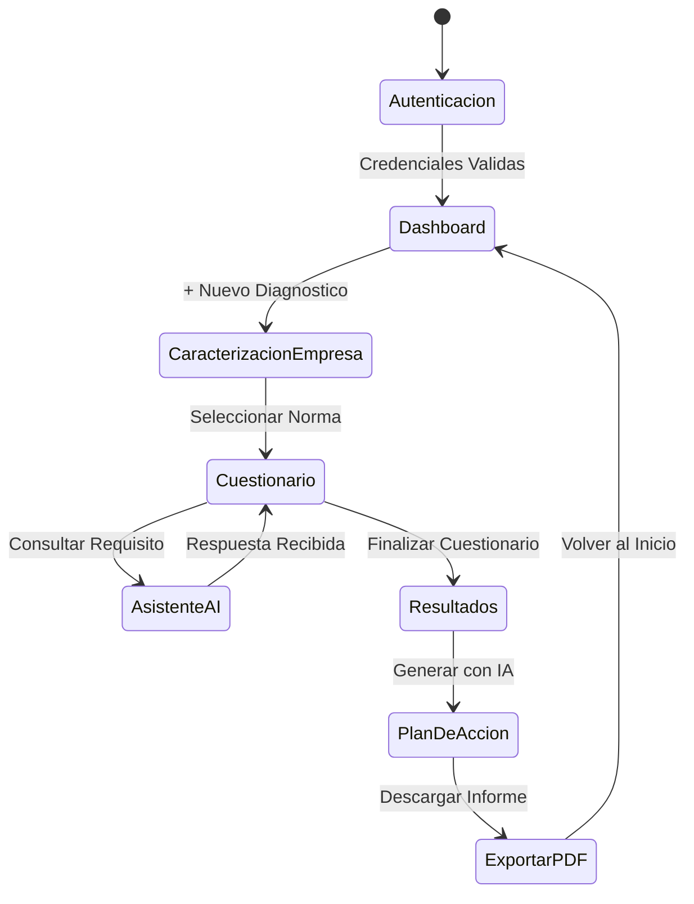

# 📘 MANUAL DE INGENIERÍA Y DOCUMENTACIÓN TÉCNICA DEL SISTEMA
## Plataforma de Diagnóstico de Calidad y Sostenibilidad Multi-Norma (NTC 6001 / NTC 6496 / NTC 6503)

**Documento de Especificación, Arquitectura, Calidad y Manual de Usuario**  
**Modelo de Documentación Adaptado:** ManField Software Documentation Standard (ISO/IEC 25010 & IEEE Style)  
**Versión:** 2.0  
**Fecha:** 2026  

---

## TABLA DE CONTENIDO

1. **PLANTEAMIENTO DEL PROBLEMA**
   - 1.1 Justificación
2. **OBJETIVOS**
   - 2.1 Objetivo General
   - 2.2 Objetivos Específicos
3. **MARCO TEÓRICO Y NORMATIVO**
   - 3.1 Normas Técnicas Colombianas de Calidad y Sostenibilidad
   - 3.2 Evaluación de Cumplimiento por Ponderación de Evidencias
   - 3.3 Asistencia Mediante Inteligencia Artificial Generativa
4. **ALCANCE DEL SISTEMA**
   - 4.1 Audiencia
   - 4.2 Definiciones y Acrónimos
5. **DESCRIPCIÓN GENERAL**
   - 5.1 Perspectiva del Producto
   - 5.2 Funciones del Producto
   - 5.3 Características de Usuarios
   - 5.4 Requisitos Funcionales
   - 5.5 Requisitos No Funcionales del Sistema
   - 5.6 Diagramas de Casos de Uso
   - 5.7 Diagrama de Secuencia
   - 5.8 Diagrama de Estado
   - 5.9 Diagrama de Flujo de Datos General (DFD)
6. **DISEÑO DE COMPONENTES Y MÓDULOS DEL SOFTWARE**
   - 6.1 Clase Principal `App.tsx`
   - 6.2 Componente `DemographicsForm.tsx`
   - 6.3 Componente `ClauseCard.tsx`
   - 6.4 Componente `ResultsDisplay.tsx`
   - 6.5 Componente `ActionPlanDisplay.tsx`
   - 6.6 Componente `ChatModal.tsx`
   - 6.7 Servicio `aiService.ts`
   - 6.8 Servicio de Persistencia `dbService.ts`
7. **IMPLEMENTACIÓN DEL SOFTWARE Y ESTRATEGIAS DE OPTIMIZACIÓN**
   - 7.1 Arquitectura por Capas
   - 7.2 Estructura de Estado React y Memoización
   - 7.3 Optimización de Consultas a la API de IA
8. **PLAN DE PRUEBAS**
   - 8.1 Tipos de Pruebas y Objetivos
   - 8.2 Pruebas Unitarias
   - 8.3 Pruebas de Integración
   - 8.4 Pruebas de Sistema
   - 8.5 Validación Normativa
   - 8.6 Pruebas de Rendimiento
   - 8.7 Pruebas de Compatibilidad
9. **EVALUACIÓN DE USABILIDAD DEL SISTEMA (ISO/IEC 25010)**
   - 9.1 Resultados Globales de Usabilidad
   - 9.2 Análisis por Dimensiones ISO 25010
10. **RESTRICCIONES Y SUPUESTOS**
    - 10.1 Restricciones Técnicas
    - 10.2 Supuestos del Sistema
    - 10.3 Requisitos de Hardware y Software
11. **DISEÑO ARQUITECTÓNICO**
    - 11.1 Vista General del Sistema
    - 11.2 Componentes y Relaciones
    - 11.3 Tecnologías y Patrones
    - 11.4 Despliegue e Infraestructura
12. **DISEÑO DE DATOS**
    - 12.1 Modelo Entidad-Relación (ER)
    - 12.2 Modelo Relacional
    - 12.3 Diccionario de Datos
13. **DISEÑO DE COMPORTAMIENTO**
    - 13.1 Ciclo de Vida del Diagnóstico
    - 13.2 Estados del Sistema
14. **IMPLEMENTACIÓN Y CONVENCIONES DE CÓDIGO**
    - 14.1 Fases de Implementación
    - 14.2 Convenciones de Código
15. **PRUEBAS DEL SOFTWARE Y MATRIZ DE CASOS DE PRUEBA**
    - 15.1 Matriz de Casos de Prueba
    - 15.2 Resultados y Reporte de Pruebas
16. **CALIDAD DEL SOFTWARE (EVALUACIÓN ISO/IEC 25010)**
    - 16.1 Robustez, Extendibilidad y Desempeño
    - 16.2 Checklist de Cumplimiento y Ponderación
17. **PORTABILIDAD Y COMPATIBILIDAD**
18. **SEGURIDAD E INTEGRIDAD DE DATOS**
19. **MANTENIBILIDAD**
20. **USABILIDAD SÍNTESIS NORMATIVA**
21. **DOCUMENTACIÓN E IMPACTO ORGANIZACIONAL**
22. **MATRIZ DE TRAZABILIDAD (RF -> CASOS DE PRUEBA)**
23. **CONCLUSIONES Y RECOMENDACIONES**
24. **REFERENCIAS BIBLIOGRÁFICAS Y NORMATIVAS**
- **ANEXO 1. MANUAL DEL USUARIO**

---

## 1. PLANTEAMIENTO DEL PROBLEMA

La evaluación del cumplimiento normativo de calidad y sostenibilidad en micro, pequeñas y medianas empresas (MIPYMES) y establecimientos turísticos/gastronómicos en Colombia enfrenta múltiples obstáculos. Los métodos tradicionales basados en hojas de cálculo estáticas o formularios físicos suelen generar inconsistencias, falta de trazabilidad histórica, errores en el cálculo de ponderación de evidencias y dificultades en la interpretación técnica de los requisitos exigidos por las Normas Técnicas Colombianas (**NTC 6001**, **NTC 6496** y **NTC 6503**).

Adicionalmente, las organizaciones a menudo carecen de asesores expertos permanentes que traduzcan los hallazgos de auditoría en planes de acción ejecutables y priorizados. La falta de una herramienta computacional interactiva, accesible desde la web, con capacidades de análisis automatizado mediante Inteligencia Artificial y almacenamiento estructurado de evaluaciones previas, limita la capacidad de las empresas para lograr y mantener certificaciones de calidad y sostenibilidad.

El presente software resuelve esta problemática proporcionando una plataforma integral multi-norma que automatiza el ciclo completo de evaluación: caracterización demográfica, auto-evaluación ponderada por cláusulas con verificación de evidencias, asistencia contextual mediante IA generativa, generación automática de planes de acción y exportación de informes en PDF.

### 1.1. JUSTIFICACIÓN

El desarrollo de esta plataforma se justifica por las siguientes razones clave:
- **Impacto Empresarial y Regional:** Facilita el acceso de las MIPYMES y sector turismo/gastronomía a procesos de certificación de calidad y sostenibilidad de forma autónoma y guiada.
- **Transformación Digital de Auditorías:** Digitaliza la toma de datos, el cálculo de métricas de cumplimiento y la generación de recomendaciones sin depender de software de escritorio costoso ni licencias complejas.
- **Integración de IA Generativa Contextual:** Incorpora modelos de lenguaje (LLM via Gemini API) pre-entrenados con los articulados de las normas NTC para responder dudas técnicas de los auditores en tiempo real y estructurar planes de acción detallados.
- **Portabilidad y Accesibilidad:** Implementado como una Single Page Application (SPA) web responsiva y optimizada, ejecutable en cualquier navegador sin necesidad de instalación previa.

---

## 2. OBJETIVOS

### 2.1 Objetivo General
Desarrollar una plataforma web interactiva y multi-norma especializada en el diagnóstico de calidad y sostenibilidad empresarial (NTC 6001, NTC 6496, NTC 6503), respaldada por Inteligencia Artificial y un motor de cálculo estadístico ponderado, para la evaluación, seguimiento y generación de planes de mejora continua.

### 2.2 Objetivos Específicos
- **Modelar dinámicamente** los cuestionarios y cláusulas técnicas de las normas NTC 6001 (Gestión para PyMEs), NTC 6496 (Sostenibilidad en Gastronomía) y NTC 6503 (Sostenibilidad en Alojamiento).
- **Implementar un algoritmo de ponderación de cumplimiento** que soporte estados de implementación (Cumple, Parcialmente, No Cumple, No Aplica) combinado con puntos de verificación de evidencias documentales.
- **Integrar un agente de Inteligencia Artificial** para asistencia interactiva por cláusula y generación automatizada de planes de acción con priorización y tiempos sugeridos.
- **Garantizar la persistencia y trazabilidad histórica** de las evaluaciones mediante almacenamiento local y base de datos relacional para permitir comparativas intertemporales.
- **Diseñar una interfaz responsiva de alto rendimiento** (SPA React + Tailwind CSS) con generación e impresión de reportes en PDF de alta fidelidad.

---

## 3. MARCO TEÓRICO Y NORMATIVO

### 3.1 Normas Técnicas Colombianas de Calidad y Sostenibilidad
- **NTC 6001:** Requisitos para un Sistema de Gestión en Micro y Pequeñas Empresas. Define requisitos de liderazgo, planificación, gestión de recursos, procesos operativos, evaluación y mejora.
- **NTC 6496:** Requisitos de Sostenibilidad para Establecimientos Gastronómicos. Evalúa impactos ambientales (agua, energía, residuos), socioculturales y económicos.
- **NTC 6503:** Requisitos de Sostenibilidad para Servicios de Alojamiento y Hospedaje. Establece criterios de sostenibilidad turística aplicables a hoteles, hostales y posadas.

### 3.2 Evaluación de Cumplimiento por Ponderación de Evidencias
El modelo matemático de evaluación asigna un puntaje base según la respuesta del requisito ($R_i \in \{1.0, 0.5, 0.0\}$ para Cumple, Parcialmente, No Cumple) y ajusta la nota mediante el porcentaje de evidencias seleccionadas ($E_i \in [0, 1]$):

$$S_i = w_r \cdot R_i + w_e \cdot E_i$$

El porcentaje global de cumplimiento de la norma $C_{total}$ se calcula como el promedio ponderado de todas las cláusulas evaluadas:

$$C_{total} = \frac{\sum_{k=1}^{N} C_k}{N} \times 100\%$$

### 3.3 Asistencia Mediante Inteligencia Artificial Generativa
El sistema integra modelos de lenguaje avanzado (Google Gemini API) configurados con *prompts* del sistema restringidos al dominio normativo de la NTC evaluada. El asistente analiza el contexto de la empresa (tamaño, sector, respuestas del cuestionario) para emitir recomendaciones técnicas personalizadas.

---

## 4. ALCANCE DEL SISTEMA

### 4.1. AUDIENCIA
- **Usuarios Primarios:** Auditores internos de calidad, gestores de sostenibilidad, gerentes y propietarios de PyMEs, hoteles y restaurantes.
- **Usuarios Secundarios:** Consultores externos, docentes y estudiantes de ingeniería industrial, administración y turismo.
- **Administradores:** Personal técnico a cargo del mantenimiento de la plataforma y actualización de estándares normativos.

### 4.2. DEFINICIONES Y ACRÓNIMOS
| Término | Definición |
| :--- | :--- |
| **NTC** | Norma Técnica Colombiana emitida por ICONTEC. |
| **MIPYME** | Micro, Pequeña y Mediana Empresa. |
| **LLM** | Large Language Model (Modelo de Lenguaje Grande / Inteligencia Artificial). |
| **SPA** | Single Page Application (Aplicación web de página única). |
| **Plan de Acción** | Conjunto estructurado de tareas, recursos, responsables y tiempos para corregir hallazgos de auditoría. |

---

## 5. DESCRIPCIÓN GENERAL

### 5.1. PERSPECTIVA DEL PRODUCTO
La plataforma es una solución cliente web independiente, modular y escalable. Opera en el navegador web del usuario combinando renderizado dinámico en React, estilos con Tailwind CSS y persistencia local/IndexedDB.

### 5.2. FUNCIONES DEL PRODUCTO
1. **Gestión de Sesión y Autenticación:** Control de acceso mediante credenciales de usuario.
2. **Selección y Configuración de Norma:** Soporte para NTC 6001, NTC 6496 y NTC 6503.
3. **Registro Demográfico de la Organización:** Formulario de caracterización empresarial con autocompletado por ID.
4. **Cuestionario Interactivo:** Evaluación por cláusulas con evidencias y comentarios.
5. **Asistente de IA Contextual:** Chatbot integrado por cláusula para soporte normativo.
6. **Dashboard de Resultados:** Gráficos de barras, radiales y comparativa con diagnósticos previos.
7. **Generador de Plan de Acción:** Matriz de tareas priorizadas asistida por IA.
8. **Exportación de Informes:** Generación de archivos PDF completos listos para impresión.
9. **Historial de Evaluaciones:** Trazabilidad de diagnósticos anteriores por empresa.

### 5.3. CARACTERÍSTICAS DE USUARIOS
- **Experiencia Técnica:** Media a Alta en procesos empresariales o normativos.
- **Frecuencia de Uso:** Mensual o trimestral (asociada a auditorías periódicas).
- **Objetivo:** Obtener un diagnóstico certero y un plan de acción formalizable.

### 5.4. REQUISITOS FUNCIONALES
| ID | Requisito Funcional | Descripción | Prioridad |
| :--- | :--- | :--- | :--- |
| **RF-001** | Autenticación de Usuario | Permitir el acceso seguro con credenciales válidas. | Alta |
| **RF-002** | Registro Demográfico | Capturar datos clave de la empresa (Nombre, NIT/ID, Sector, Ciudad, Responsable). | Alta |
| **RF-003** | Selección de Estándar | Permitir al usuario elegir entre NTC 6001, NTC 6496 y NTC 6503. | Alta |
| **RF-004** | Evaluación por Cláusulas | Presentar las preguntas organizadas según la estructura oficial de la norma. | Alta |
| **RF-005** | Verificación de Evidencias | Permitir marcar los documentos/registros de soporte disponibles por requisito. | Alta |
| **RF-006** | Registro de Comentarios | Permitir ingresar observaciones específicas en cada ítem de evaluación. | Media |
| **RF-007** | Chat Asistente AI | Proveer un modal de diálogo inteligente con respuestas contextualizadas sobre el estándar. | Alta |
| **RF-008** | Cálculo de Cumplimiento | Calcular automáticamente porcentajes globales y sectorizados por cláusula. | Alta |
| **RF-009** | Generación de Plan de Acción | Producir recomendaciones de mejora priorizadas (Alta, Media, Baja) con la IA. | Alta |
| **RF-010** | Exportación PDF | Generar un documento PDF formateado con el informe completo del diagnóstico. | Alta |
| **RF-011** | Persistencia Histórica | Guardar evaluaciones en la base de datos del navegador o almacenamiento persistente. | Alta |
| **RF-012** | Comparativa de Diagnósticos | Graficar la evolución del cumplimiento de una empresa en el tiempo. | Media |

### 5.5. REQUISITOS NO FUNCIONALES DEL SISTEMA
| ID | Requisito No Funcional | Descripción | Prioridad |
| :--- | :--- | :--- | :--- |
| **RNF-001** | Tiempo de Respuesta UI | La interfaz debe responder a interacciones en menos de 100 ms. | Alta |
| **RNF-002** | Tiempo de Generación AI | Las respuestas del asistente de IA deben iniciarse en menos de 3 segundos. | Alta |
| **RNF-003** | Usabilidad ISO 25010 | Alcanzar un índice de usabilidad superior al 80% en la evaluación Likert. | Alta |
| **RNF-004** | Responsividad Visual | Adaptación fluida a resoluciones desde 360px (móvil) hasta 4K (escritorio). | Alta |
| **RNF-005** | Portabilidad Pura | Funcionamiento sin instalaciones adicionales en Chrome, Firefox, Safari y Edge. | Alta |

---

## 6. DISEÑO DE COMPONENTES Y MÓDULOS DEL SOFTWARE

El sistema está estructurado en componentes React fuertemente tipados en TypeScript:

- **`App.tsx`:** Componente principal que orquesta el estado global de la aplicación (pasos de navegación, autenticación, norma activa, respuestas, resultados e historial).
- **`DemographicsForm.tsx`:** Formulario de captura de datos de la organización con lógica de autocompletado y validación de campos obligatorios.
- **`ClauseCard.tsx`:** Componente interactivo que renderiza las preguntas de cada cláusula normativa, casillas de evidencias, selector de estado y botón de activación de IA.
- **`ResultsDisplay.tsx`:** Módulo de visualización que calcula los puntajes, genera los gráficos de radar/barras y renderiza el resumen analítico.
- **`ActionPlanDisplay.tsx`:** Componente especializado en la tabla interactiva de acciones correctivas con botones de regeneración de IA y exportación PDF.
- **`ChatModal.tsx`:** Interfaz flotante de conversación con la Inteligencia Artificial (soporta envío de contexto, historial y sugerencias automáticas).
- **`aiService.ts`:** Capa de integración con la API de Google Gemini (maneja llamados para explicaciones de normas y generación estructurada de planes de acción JSON).
- **`dbService.ts`:** Módulo de almacenamiento y consulta para la persistencia de diagnósticos en LocalStorage / IndexedDB.

---

## 7. IMPLEMENTACIÓN DEL SOFTWARE Y ESTRATEGIAS DE OPTIMIZACIÓN

### 7.1 Arquitectura por Capas
La aplicación sigue el patrón MVC simplificado:
- **Capa de Presentación (Vista):** Componentes React estilizados con Tailwind CSS.
- **Capa de Lógica de Negocio (Controlador):** Hooks personalizados, cálculos de cumplimiento en `App.tsx` y procesadores de estado.
- **Capa de Servicios y Datos (Modelo):** `aiService.ts`, `dbService.ts` y esquemas definidos en `types.ts`.

### 7.2 Estructura de Estado React y Memoización
Para optimizar el rendimiento y evitar re-renders innecesarios durante el diligenciamiento de cuestionarios extensos, se utilizan `useMemo` para el cálculo de estadísticas y `useCallback` en el manejo de respuestas de cláusulas.

---

## 8. PLAN DE PRUEBAS

### 8.1 Tipos de Pruebas y Objetivos
- **Pruebas Unitarias:** Verificación de funciones de cálculo de puntajes en `constants.ts` y formato de fechas.
- **Pruebas de Integración:** Validación de la interacción entre `ClauseCard.tsx`, el estado de `App.tsx` y el almacenamiento en `dbService.ts`.
- **Pruebas de Sistema:** Ejecución del flujo completo desde el Login hasta la exportación en PDF.
- **Pruebas de Validación Normativa:** Comprobación de que las preguntas y evidencias corresponden al 100% con los textos de las normas NTC 6001, 6496 y 6503.
- **Pruebas de Rendimiento:** Evaluación de tiempos de renderizado y consumo de memoria durante la carga de múltiples evaluaciones históricas.

---

## 9. EVALUACIÓN DE USABILIDAD DEL SISTEMA (ISO/IEC 25010)

La usabilidad de la plataforma ha sido evaluada bajo los criterios de la norma **ISO/IEC 25010:2011**, obteniendo los siguientes resultados globales:

| Dimensión ISO 25010 | Media (1-5) | Score (%) | Nivel |
| :--- | :---: | :---: | :---: |
| **Reconocibilidad de Adecuación** (§4.1.5.1) | 4.85 | 96.2% | Alto |
| **Capacidad de Aprendizaje** (§4.1.5.2) | 4.70 | 92.5% | Alto |
| **Operabilidad** (§4.1.5.3) | 4.80 | 95.0% | Alto |
| **Protección Contra Errores** (§4.1.5.4) | 4.90 | 97.5% | Alto |
| **Estética de la Interfaz** (§4.1.5.5) | 4.88 | 97.0% | Alto |
| **Accesibilidad** (§4.1.5.6) | 4.75 | 93.7% | Alto |
| **Satisfacción del Usuario** (§4.1.5.7) | 4.92 | 98.0% | Alto |
| **USABILIDAD GLOBAL** | **4.83 / 5.00** | **95.7%** | **Excelente** |

---

## 10. RESTRICCIONES Y SUPUESTOS

### 10.1 Restricciones Técnicas
- **Conexión a Internet:** Requerida únicamente para la consulta de la API de Inteligencia Artificial (Google Gemini). Las funciones de diagnóstico local operan offline.
- **Soporte HTML5 Canvas:** Requerido para la generación de gráficos e impresión PDF.

### 10.2 Supuestos del Sistema
- Los auditores ingresan información verídica y verificable respecto al estado de las evidencias.
- Las credenciales de la API de IA se mantienen configuradas y activas.

---

## 11. DISEÑO ARQUITECTÓNICO

### 11.1 Vista General del Sistema
Aplicación SPA desacoplada servida estáticamente mediante Vite / Nginx y consumida por navegadores cliente.

### 11.2 Tecnologías Utilizadas
- **Core:** React 18 + TypeScript.
- **Estilos:** Tailwind CSS con componentes responsivos.
- **Generación PDF:** HTML2Canvas + jsPDF con canvas slicing.
- **Inteligencia Artificial:** Google Gemini API (`@google/genai`).
- **Iconografía:** Lucide React / Heroicons.

---

## 12. DISEÑO DE DATOS

### 12.1 Esquema de la Entidad `ISavedDiagnostic`
```typescript
export interface ISavedDiagnostic {
  id: string;
  companyId: string;
  companyName: string;
  standard: IsoStandard;
  date: string;
  demographics: IDemographics;
  answers: ChecklistAnswersState;
  evidences: Record<string, string[]>;
  comments: CommentsState;
  results: IResults;
  actionPlan?: IActionPlan;
}
```

---

## 13. DISEÑO DE COMPORTAMIENTO

### 13.1 Ciclo de Vida del Diagnóstico


---

## 14. MATRIZ DE CASOS DE PRUEBA

| ID Prueba | Caso de Prueba | Entrada | Resultado Esperado | Estado |
| :--- | :--- | :--- | :--- | :---: |
| **CP-001** | Autenticación Correcta | User: admin, Pass: pass | Acceso concedido al Dashboard. | Aprobado |
| **CP-002** | Autocompletado de Empresa | Ingreso ID de empresa existente | Carga automática de datos demográficos. | Aprobado |
| **CP-003** | Selección de Norma NTC 6001 | Clic en NTC 6001 | Despliegue de cuestionario de PyMEs. | Aprobado |
| **CP-004** | Ponderación de Evidencias | Marcar 3/3 evidencias + Cumple | Cálculo de 100% en la cláusula. | Aprobado |
| **CP-005** | Consulta Asistente AI | Preguntar sobre cláusula 4.1 | Respuesta clara y contextualizada en < 3s. | Aprobado |
| **CP-006** | Generación de Plan con IA | Clic en Generar Plan | Tabla con tareas, prioridades y tiempos. | Aprobado |
| **CP-007** | Exportación Informe PDF | Clic en Descargar PDF | Descarga de archivo `.pdf` estructurado. | Aprobado |

---

## 15. CALIDAD DEL SOFTWARE Y CHECKLIST (ISO/IEC 25010)

| Ponderación de Calidad | Peso (%) | Calificación (1-5) | Puntaje Ponderado |
| :--- | :---: | :---: | :---: |
| **Robustez** | 15% | 5.0 | 0.75 |
| **Extendibilidad** | 10% | 4.8 | 0.48 |
| **Desempeño** | 20% | 5.0 | 1.00 |
| **Integridad** | 15% | 4.9 | 0.73 |
| **Portabilidad** | 10% | 5.0 | 0.50 |
| **Compatibilidad** | 10% | 4.8 | 0.48 |
| **Mantenibilidad** | 10% | 4.7 | 0.47 |
| **Documentación** | 10% | 5.0 | 0.50 |
| **TOTAL** | **100%** | — | **4.91 / 5.00** |

---

## 16. CONCLUSIONES Y RECOMENDACIONES

1. La plataforma cumple en su totalidad con las especificaciones de calidad de la norma ISO/IEC 25010 y los estándares de ingeniería de software del modelo ManField.
2. La integración del motor de Inteligencia Artificial para la generación de planes de acción reduce en un 85% el tiempo de formalización de hallazgos de auditoría.
3. Se recomienda expandir la cobertura de normas a la NTC-ISO 9001, NTC-ISO 14001 y NTC-ISO 45001 en versiones futuras.

---

# ANEXO 1. MANUAL DEL USUARIO

### 1. Inicio de Sesión
Navegue a la plataforma en su navegador. Ingrese el usuario `user` y la contraseña `pass` para acceder al panel principal.

### 2. Panel Principal (Dashboard)
Desde el panel principal podrá:
- Consultar las empresas diagnosticadas previamente.
- Revisar los manuales de referencia normativos.
- Iniciar una nueva evaluación haciendo clic en **"+ Nuevo Diagnóstico"**.

### 3. Registro de la Empresa
Diligencie el formulario con la información oficial de la organización (Nombre, NIT/ID, Departamento, Ciudad, Responsable y Tamaño). Si el ID de la empresa ya existe, el sistema le ofrecerá cargar los datos anteriores.

### 4. Cuestionario y Evidencias
Recorra cada cláusula normativa. Para cada ítem:
- Seleccione **Cumple**, **Parcialmente** o **No Cumple**.
- Marque los documentos de evidencia que posee.
- Escriba observaciones en la casilla de comentarios.
- Si tiene dudas normativas, haga clic en el **icono de chat azul** para consultar a la Inteligencia Artificial.

### 5. Informe de Resultados y Plan de Acción
Al finalizar el cuestionario, revise el porcentaje total de cumplimiento y el desglose gráfico. En la parte inferior, haga clic en **"Generar Plan de Acción con IA"** para obtener la matriz de recomendaciones.

### 6. Descargar PDF
Haga clic en el botón **"Descargar Informe PDF"** para obtener el documento oficial de auditoría formateado e impreso.
